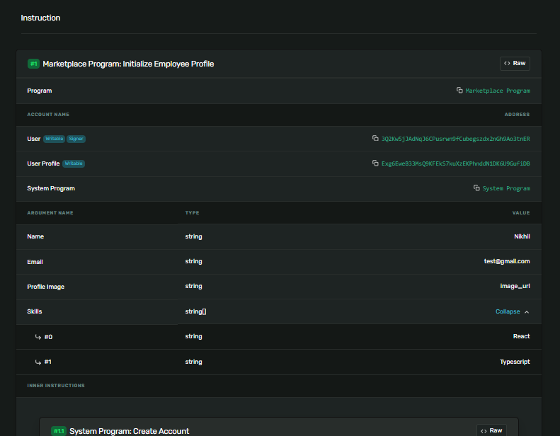

### Capstone

## Steps to run it on local

- Pull the repo and switch to marketplace branch

Replace the wallet location in Anchor.toml

**replace this**

`wallet = "/home/nikhilkr/.config/solana/id.json"`

**with your wallet location**

`wallet = "/Users/nursultanseyhanlioglu/.config/solana/id.json"`

#

## Install the dependencies

```
npm install
```

Build

```
anchor build
```

Init IDL

`anchor idl init  --filepath target/idl/marketplace_program.json Hnf7nuJLhXP5pMh7AQrqratPUWcAXzsw6MUf6vacY23V`

Deploy

`anchor deploy`

#

### Run `solana-test-validator` on a different terminal

#

## Testing

```
anchor test
```

Run the test which will return the transaction address in console,
you can view it on [explorer.solana](https://explorer.solana.com/)

## Example -


